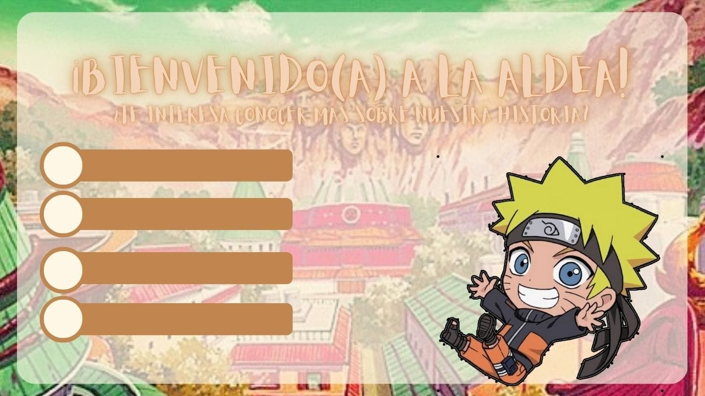
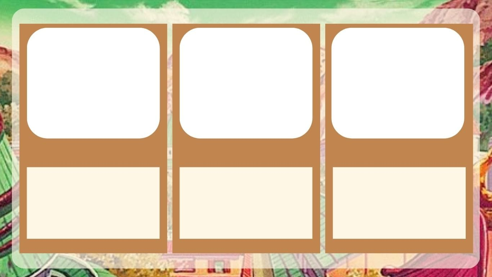
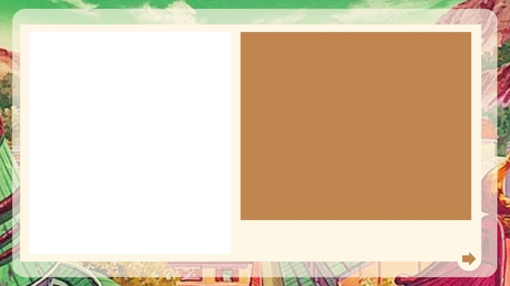
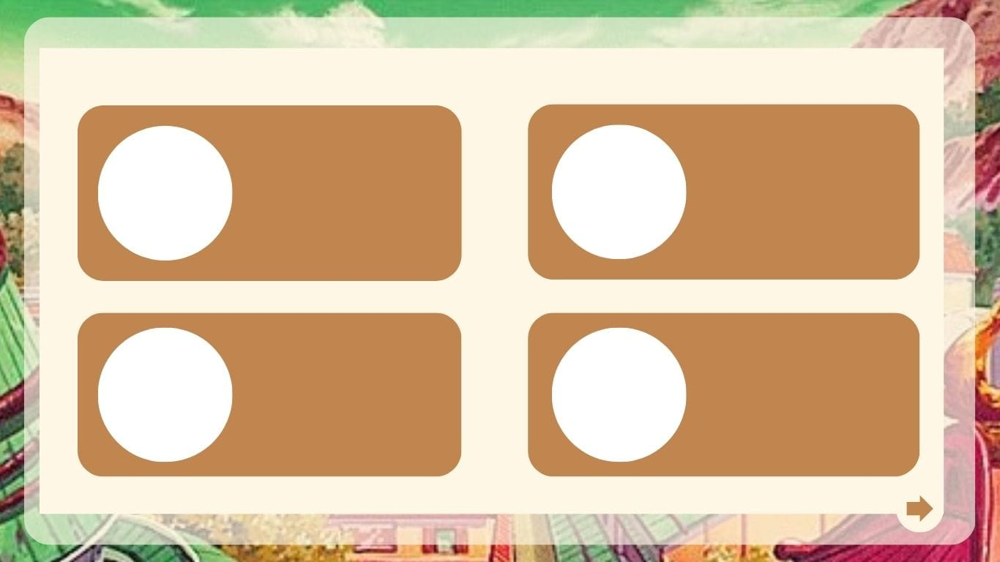

# Naruto Word

¡Hola, querido(a) ninja! Si estás aquí, es porque deseas conocer más sobre nuestra aldea y la serie de Naruto. ¡Has llegado al lugar correcto!

## ¿Qué es lo que queremos conseguir con esta página?

El objetivo principal de este proyecto es recolectar y presentar información sobre la serie Naruto de una manera dinámica y atractiva para los fans del anime. Queremos ofrecer una experiencia visual y entretenida para que puedas disfrutar conociendo más sobre tu anime favorito.

## Historia del Proyecto

### ¿Cómo surge la idea de esta web?

La idea de este proyecto nació al darnos cuenta de la extensa cantidad de información disponible sobre Naruto. Decidimos compilarla y organizarla de manera entretenida como parte de un proyecto con el fin de ofrecer una plataforma más accesible y divertida para los fans.

### Bocetos y Diseño

Para comenzar, creamos una serie de bocetos que nos ayudaron a visualizar y organizar la estructura de la web. Aquí te mostramos algunos de nuestros bocetos iniciales:

#### Boceto General

En esta sección, se presenta la estructura general del sitio, incluyendo la disposición de las secciones y una imagen destacada del protagonista de la serie.

#### Bocetos de Secciones

# Bocetos del Proyecto

## Boceto de Sección 1

## Boceto de Sección 2

## Boceto de Sección 3

Estos bocetos nos sirvieron como referencia para organizar la información, diseñar plantillas y asegurar una navegación fluida en el sitio.

##
